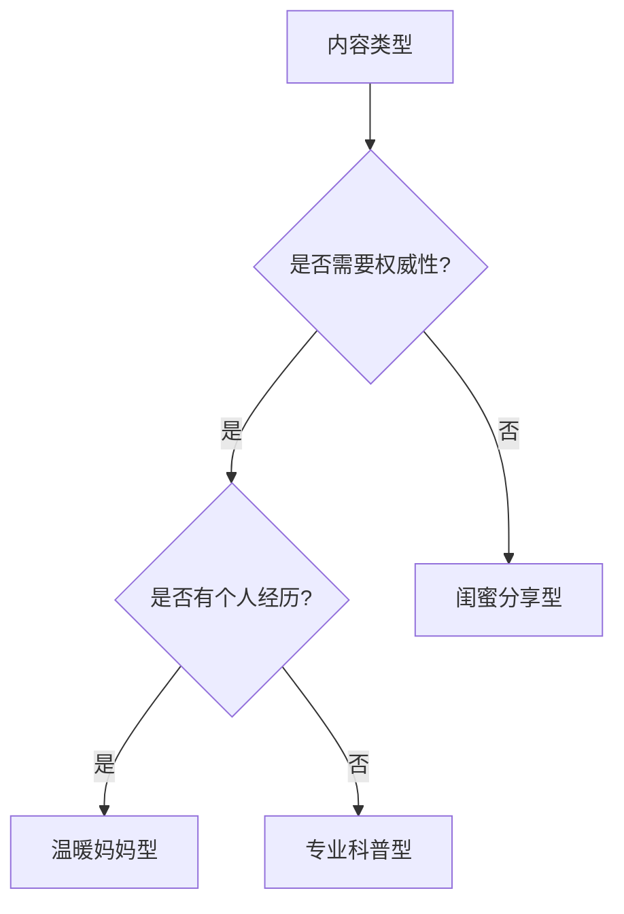

# xhs-styles Skill - 小红书文风

定义三种小红书母婴内容文风，指导写作风格。

---

## 技能概述

**目的：** 为小红书母婴内容提供三种预设文风
**使用方式：** 写作时读取对应文风定义

---

## 三种文风概览

| 文风 | 适用场景 | 核心特点 | 语气 |
|------|----------|----------|------|
| 温暖妈妈型 | 经验分享、心得体会 | 亲切、有温度 | 像邻居姐姐 |
| 专业科普型 | 知识科普、辟谣 | 专业可信 | 像医生朋友 |
| 闺蜜分享型 | 好物推荐、日常记录 | 轻松真实 | 像好闺蜜 |

---

## 文风选择指南

### 根据内容类型选择



### 根据话题选择

| 话题 | 推荐文风 | 原因 |
|------|----------|------|
| 睡眠训练 | 温暖妈妈型/专业科普型 | 需要共情+方法论 |
| 辅食添加 | 专业科普型/闺蜜分享型 | 知识+好物推荐 |
| 好物推荐 | 闺蜜分享型 | 真实分享 |
| 发育问题 | 专业科普型 | 需要权威性 |
| 育儿心得 | 温暖妈妈型 | 情感共鸣 |
| 踩坑避雷 | 闺蜜分享型 | 真实有趣 |

---

## 文风特征对比

### 开头方式

| 文风 | 开头示例 |
|------|----------|
| 温暖妈妈型 | "还记得宝宝那个月夜醒无数次的日子吗？我太懂那种崩溃了..." |
| 专业科普型 | "睡眠训练 ≠ 让宝宝哭！今天就来科普一下这个被误解的概念..." |
| 闺蜜分享型 | "姐妹们！这个睡眠神器我必须安利给你们！！！" |

### 核心内容表达

| 文风 | 表达特点 |
|------|----------|
| 温暖妈妈型 | "我的经验是...每个宝宝不一样，但你可以试试..." |
| 专业科普型 | "根据美国儿科学会的建议...研究表明..." |
| 闺蜜分享型 | "我用下来觉得...真的绝了！比之前那个好用太多！" |

### 结尾方式

| 文风 | 结尾示例 |
|------|----------|
| 温暖妈妈型 | "每个妈妈都不容易，加油！有问题随时问我~" |
| 专业科普型 | "如果宝宝情况特殊，建议咨询儿科医生。收藏起来慢慢看！" |
| 闺蜜分享型 | "你们用过吗？评论区一起唠唠呗！" |

---

## emoji 使用规范

| 文风 | 使用频率 | 常用 emoji |
|------|----------|------------|
| 温暖妈妈型 | 中等 | 💕 🥰 ✨ 🌟 |
| 专业科普型 | 较少 | 💡 ⚠️ ✅ ❌ |
| 闺蜜分享型 | 较多 | 🔥 ❗ 💯 😭 🥺 |

---

## 语气词使用

| 文风 | 语气词 |
|------|--------|
| 温暖妈妈型 | "呢"、"呀"、"吧" |
| 专业科普型 | "的确"、"实际上"、"需要注意的是" |
| 闺蜜分享型 | "啊"、"哈哈"、"绝了"、"真的" |

---

## 详细文风定义

详见各文风的参考文件：
- `references/温暖妈妈型.md`
- `references/专业科普型.md`
- `references/闺蜜分享型.md`

---

## 使用方式

在写作时：

```markdown
1. 确定内容类型和话题
2. 选择或由用户指定文风
3. 阅读对应文风的详细定义
4. 按文风特征进行写作
5. 使用对应的 emoji 和语气词
```
